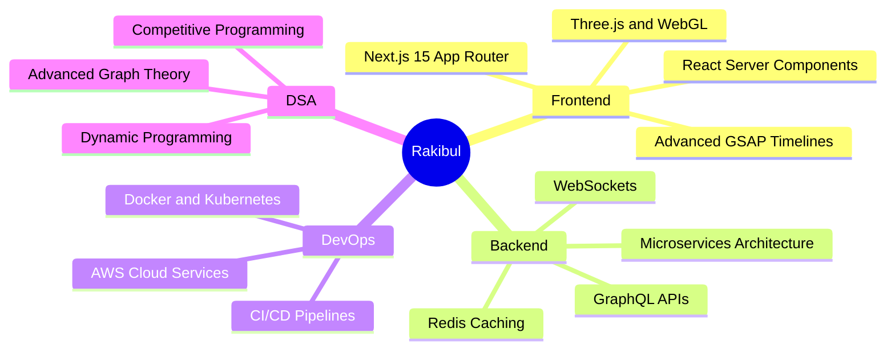

<div align="center">

<!-- ═══════════════════════════════════════════ -->
<!--              HEADER SECTION                -->
<!-- ═══════════════════════════════════════════ -->


<br/>


<br/><br/>


&nbsp;

&nbsp;

&nbsp;


</div>

<br/>

---

## 🧬 `whoami`

<table>
<tr>
<td width="55%" valign="top">

```typescript
╔══════════════════════════════════════╗
║         RAKIBUL HASAN  v2.0          ║
╠══════════════════════════════════════╣
║  Role     →  Full Stack Developer    ║
║  Country  →  Bangladesh 🇧🇩           ║
║  Focus    →  Next.js + TypeScript    ║
║  Backend  →  Node.js + Django        ║
║  DBs      →  MongoDB + PostgreSQL    ║
║  Auth     →  JWT + Session Tokens    ║
║  DSA      →  C/C++ (Daily Grind 🔥)  ║
║  Status   →  Building & Learning     ║
║  Fun Fact →  I debug in console.log  ║
╚══════════════════════════════════════╝
```

<br/>

**📫 Reach Me:**
`rakibulhasanshuvo206@gmail.com`

<br/>

<a href="https://drive.google.com/file/d/1hE3_HVzS6cN34A7eesGNCZ_CE1DPj9x-/view?usp=sharing">
  
</a>
<br/><br/>
<a href="https://rakibulhasanshuvo.netlify.app/">
  
</a>

</td>
<td width="45%" align="center" valign="middle">


<br/><br/>


</td>
</tr>
</table>

---

## 🌐 Connect With Me

<div align="center">

[](https://linkedin.com/in/rakibul-hasan-3a9b03269)
[](https://facebook.com/rakibul13631)
[](https://instagram.com/rakibul13631)
[](https://discord.gg/rakibul13631)
[](mailto:rakibulhasanshuvo206@gmail.com)
[](https://rakibulhasanshuvo.netlify.app/)

</div>

---

## ⚡ Tech Arsenal

<div align="center">

### 🎨 Frontend & UI Animations


### ⚙️ Backend, Database & Auth


### 💻 Languages & Core CS


### 🔧 Tools & DevOps


</div>

---

## 📊 Skill Proficiency

```text
Next.js / React      ████████████████████░   90%
TypeScript           ███████████████████░░   87%
Node.js / Express    ██████████████████░░░   85%
C / C++ (DSA)        ████████████████████░   90%
MongoDB              ████████████████░░░░░   78%
PostgreSQL           ███████████████░░░░░░   72%
GSAP Animations      ████████████████░░░░░   78%
Python / Django      ██████████████░░░░░░░   68%
Docker / DevOps      ███████████░░░░░░░░░░   55%
System Design        █████████████░░░░░░░░   63%
```

---

## 🧩 Competitive Programming

<div align="center">


<br/><br/>

[](https://codeforces.com/)
[](https://leetcode.com/rakibul263)
[](https://hackerrank.com/)

</div>

---

## 🏆 GitHub Trophies

<div align="center">
  
</div>

---

## 📈 GitHub Analytics

<div align="center">


&nbsp;


<br/><br/>


</div>

---

## 🗓️ Contribution Activity

<div align="center">
  
</div>

---

## 🐍 Contribution Snake

<div align="center">
  <picture>
    <source media="(prefers-color-scheme: dark)" srcset="https://raw.githubusercontent.com/rakibul263/rakibul263/output/github-contribution-grid-snake-dark.svg" />
    <source media="(prefers-color-scheme: light)" srcset="https://raw.githubusercontent.com/rakibul263/rakibul263/output/github-contribution-grid-snake.svg" />
    
  </picture>
</div>

---

## 🌱 Currently Exploring

<div align="center">



</div>

---

## 💬 Dev Quote of the Day

<div align="center">
  
</div>

---

## ☕ Support My Work

<div align="center">

*If you find my projects helpful, a ⭐ means a lot to me!*

<a href="https://www.buymeacoffee.com/" target="_blank">
  
</a>

</div>

---

<div align="center">


<br/>

*⭐ Star my repos if you find them useful — it means the world!*

</div>
